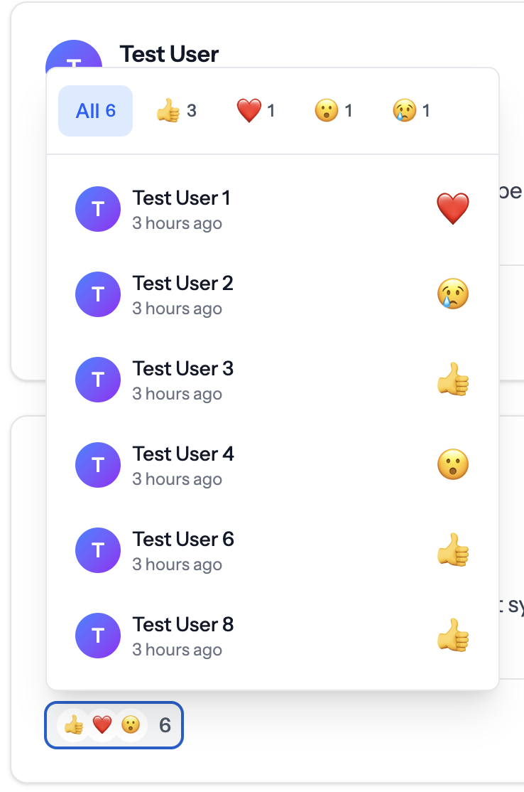

# Laravel Reactable

[](https://packagist.org/packages/truefans/laravel-reactable)
[](https://github.com/VahanDrnoyan/laravel-reactable/actions?query=workflow%3Atests+branch%3Amain)
[](https://packagist.org/packages/truefans/laravel-reactable)

A beautiful, Facebook-style reactions and comments system for Laravel with Livewire. Add customizable emoji reactions and full-featured commenting to any model in your Laravel application with a single trait.

## 📸 Demo

### Reactions System

**Light Theme**


**Dark Theme**


### Comments System

**Light Theme**


**Dark Theme**


## ✨ Features

### Reactions
- 🎭 **Facebook-Style UI** - Beautiful reaction picker with hover/click interactions
- 🔥 **Livewire Powered** - Real-time reactions without page refresh
- 📦 **Polymorphic Relations** - React to Posts, Comments, Images, or any model
- 🎨 **Fully Customizable** - Configure reaction types, icons, colors via config
- 👥 **User Reactions List** - See who reacted with filterable tabs by reaction type
- ♾️ **Infinite Scrolling** - Seamlessly load more reactions as you scroll

### Comments
- 💬 **Full Commenting System** - Add, edit, and delete comments
- 😍 **Reactions on Comments** - Users can react to comments (configurable)
- ✏️ **Inline Editing** - Edit comments with validation and XSS protection
- 🗑️ **Custom Delete Modal** - Beautiful confirmation modal with Alpine.js
- 🔄 **Load More Pagination** - Efficient pagination for long comment threads
- 🛡️ **XSS Protection** - Built-in sanitization and validation

### General
- 🌙 **Dark Mode Support** - Beautiful UI in both light and dark themes
- ⚡ **Optimized Queries** - Eager loading prevents N+1 queries
- 📱 **Responsive Design** - Works perfectly on mobile and desktop
- ♿ **Accessibility First** - Full keyboard navigation, focus management, and ARIA attributes

---

## 📋 Requirements

- PHP 8.4+
- Laravel 11.0+ or 12.0+
- Livewire 3.0+
- Alpine.js (included with Livewire)

---

## 🚀 Installation

### Step 1: Install via Composer

```bash
composer require truefans/laravel-reactable
```

### Step 2: Publish Assets

```bash
php artisan vendor:publish --provider="TrueFans\LaravelReactable\LaravelReactableServiceProvider"
```

### Step 3: Run Migrations

```bash
php artisan migrate
```

---

## 📖 Usage

### Reactions

**1. Add trait to your model:**

```php
use TrueFans\LaravelReactable\Traits\HasReactions;

class Post extends Model
{
    use HasReactions;
}
```

**2. Eager load in controller (prevents N+1 queries):**

```php
public function index()
{
    $posts = Post::with(['user', 'reactions'])
        ->latest()
        ->paginate(10);

    return view('posts.index', compact('posts'));
}
```

**3. Display in Blade:**

```blade
<livewire:tflr_reactions :model="$post" :key="'post-reactions-'.$post->id" />
```

### Comments

**1. Add trait to your model:**

```php
use TrueFans\LaravelReactable\Traits\HasComments;

class Post extends Model
{
    use HasComments;
}
```

**2. Eager load comment counts (prevents N+1 queries):**

```php
public function index()
{
    $posts = Post::with(['user', 'reactions'])
        ->withCount('comments')  // Important for performance!
        ->latest()
        ->paginate(10);

    return view('posts.index', compact('posts'));
}
```

**3. Display in Blade:**

```blade
<livewire:tflr_comments :model="$post" :key="'post-comments-'.$post->id" />
```

### Configuration

Customize reactions and enable/disable features in `config/reactable.php`:

```php
return [
    'reaction_types' => [
        'like' => ['icon' => '👍', 'label' => 'Like', 'color' => 'blue'],
        'love' => ['icon' => '❤️', 'label' => 'Love', 'color' => 'red'],
        // Add your own custom reactions!
    ],
    
    'comments' => [
        'enable_reactions' => true, // Allow reactions on comments
    ],
];
```

---

## 🎯 Advanced Usage

### Trait Methods

The `HasReactions` trait provides these methods:

```php
// Add/remove reactions
$post->react('like', $user);  // User defaults to auth()->user()
$post->unreact($user);

// Check reactions
$post->hasReactedBy($user);  // Returns bool
$post->getReactionBy($user);  // Returns 'like', 'love', etc. or null

// Get counts
$post->getReactionsSummary();  // Returns ['like' => 5, 'love' => 3, ...]
$post->getTotalReactionsCount();  // Returns int
$post->getReactionsCountByType('like');  // Returns int
```

The `HasComments` trait provides these methods:

```php
// Add/remove comments
$post->addComment('Great post!', $user);
$post->removeComment($commentId, $user);

// Check comments
$post->hasCommentedBy($user);  // Returns bool
$post->comments()->count();  // Get total comments
```

### Custom Reaction Permissions

Override the `canReact` method in your model to control who can react:

```php
class Post extends Model
{
    use HasReactions;
    
    public function canReact(string $type): bool
    {
        // Prevent users from reacting to their own posts
        if (auth()->id() === $this->user_id) {
            return false;
        }
        
        return true;
    }
}
```

     * @param string $type The reaction type (e.g., 'like', 'love')
     * @return bool Return false to hide the reaction and prevent interaction,
     *              or true to show and allow the reaction
     */
    public function canReact(string $type): bool
    {
        // Example: Prevent users from reacting to their own posts
        if (auth()->id() === $this->user_id) {
            return false;
        }

        // Example: Only allow 'like' and 'love' reactions
        if (!in_array($type, ['like', 'love'])) {
            return false;
        }

        // Example: Implement a cooldown period
        $lastReaction = $this->reactions()
            ->where('user_id', auth()->id())
            ->latest()
            ->first();

        if ($lastReaction && $lastReaction->created_at->gt(now()->subHour())) {
            return false; // 1-hour cooldown between reactions
        }

        return true;
    }
}
```

### Events

The component dispatches Livewire events:

```javascript
// Listen for reaction events
Livewire.on('reaction-added', (data) => {
    console.log('Reaction added:', data.type);
});

Livewire.on('reaction-removed', (data) => {
    console.log('Reaction removed:', data.type);
});
```

### Customizing the canReact Method

The `canReact` method receives the reaction type as a parameter, allowing you to implement different rules for different reaction types. The method should return `true` if the reaction is allowed, or `false` to prevent it.

#### Example: Role-Based Reaction Visibility

```php
public function canReact(string $type): bool
{
    // Hide all reactions for guests
    if (!auth()->check()) {
        return false;
    }

    // Only show premium reactions to premium users
    $premiumReactions = ['love', 'laugh', 'wow', 'sad', 'angry'];
    if (in_array($type, $premiumReactions) && !auth()->user()->isPremium()) {
        return false;
    }

    // Hide 'angry' reactions on Sundays (example of conditional logic)
    if ($type === 'angry' && now()->dayOfWeek === 0) {
        return false;
    }

    return true;
}
```

### Reaction Visibility vs Interaction

- When `canReact` returns `false` for a reaction type:
  - The reaction will be hidden from the reaction picker
  - The reaction will not be available in the filter tabs
  - Existing reactions of that type will be hidden from the reactions list
  - Users cannot interact with or select the reaction

- When `canReact` returns `true`:
  - The reaction is visible in the picker
  - The reaction appears in filter tabs (if any exist)
  - Users can see and interact with the reaction

### Avoiding N+1 Queries

**CRITICAL:** To prevent N+1 query issues, you **must** eager load relationships when displaying multiple models with Reactions or Comments components.

#### For Reactions Component

Always eager load the `reactions` relationship:

```php
// ✅ CORRECT - Eager load reactions to avoid N+1
$posts = Post::with(['user', 'reactions'])
    ->latest()
    ->paginate(10);

// ❌ WRONG - Will cause N+1 queries (1 query per post)
$posts = Post::with('user')
    ->latest()
    ->paginate(10);
```

**How It Works:**
- The Reactions component automatically detects if reactions are eager loaded
- If eager loaded: Uses the collection data (0 additional queries)
- If not eager loaded: Falls back to querying (causes N+1)

**Query Optimization:**
- **Without eager loading:** 1 + (N posts × 3 queries each) = 31+ queries for 10 posts
- **With eager loading:** 3 queries total (posts, users, reactions)

#### For Comments Component

Always eager load the `comments` count using `withCount()`:

```php
// ✅ CORRECT - Eager load comment counts
$posts = Post::with(['user', 'reactions'])
    ->withCount('comments')  // Adds comments_count attribute
    ->latest()
    ->paginate(10);

// ❌ WRONG - Will cause N+1 queries for comment counts
$posts = Post::with(['user', 'reactions'])
    ->latest()
    ->paginate(10);
```

**How It Works:**
- `withCount('comments')` adds a `comments_count` attribute to each model
- The Comments component checks for this attribute first
- If available: Uses the cached count (0 additional queries)
- If not available: Falls back to querying (causes N+1)

#### Complete Example Controller

Here's a complete example showing best practices for both components:

```php
use App\Models\Post;
use Illuminate\View\View;

class PostController extends Controller
{
    public function index(): View
    {
        $posts = Post::with(['user', 'reactions'])
            ->withCount('comments')
            ->whereNotNull('published_at')
            ->latest('published_at')
            ->paginate(10);

        return view('posts.index', compact('posts'));
    }

    public function show(Post $post): View
    {
        $post->load('user');
        $post->loadCount('comments');

        return view('posts.show', compact('post'));
    }
}
```

#### Blade Template Example

```blade
@foreach($posts as $post)
    <div class="post-card">
        <h2>{{ $post->title }}</h2>
        <p>{{ $post->content }}</p>

        {{-- Reactions Component (uses eager-loaded reactions) --}}
        <livewire:reactions :model="$post" :key="'post-reactions-'.$post->id" />

        {{-- Comments Component (uses eager-loaded comments_count) --}}
        <livewire:comments :model="$post" :key="'post-comments-'.$post->id" />
    </div>
@endforeach
```

#### Performance Comparison

**Without Eager Loading (N+1 Issue):**
```
1. SELECT * FROM posts                           (1 query)
2. SELECT * FROM reactions WHERE reactable_id = 1 (10 queries, 1 per post)
3. SELECT COUNT(*) FROM comments WHERE ...        (10 queries, 1 per post)
4. SELECT * FROM comments WHERE ...               (10 queries when opened)
5. SELECT * FROM reactions WHERE reactable_type = Comment (30+ queries for comment reactions)

Total: 60+ queries for 10 posts
```

**With Proper Eager Loading:**
```
1. SELECT * FROM posts                           (1 query)
2. SELECT * FROM users WHERE id IN (...)         (1 query)
3. SELECT * FROM reactions WHERE reactable_id IN (...) (1 query)
4. SELECT reactable_id, COUNT(*) FROM comments GROUP BY ... (1 query)

Total: 4 queries for 10 posts
```

#### Advanced: Eager Loading Comment Reactions

If you want to display comments with their reactions immediately (without lazy loading), you can eager load them:

```php
// This is handled automatically by the Comments component
// Comments are loaded with reactions when the user expands the comments section
// No additional configuration needed!
```

The Comments component uses a computed property that automatically eager loads Comment models with their reactions in a single `whereIn` query when the comments section is expanded.

#### Troubleshooting N+1 Issues

If you're experiencing slow page loads, use Laravel Debugbar or Telescope to check for N+1 queries:

```bash
# Install Laravel Debugbar (development only)
composer require barryvdh/laravel-debugbar --dev

# Or use Laravel Telescope
composer require laravel/telescope
php artisan telescope:install
php artisan migrate
```

**Common Signs of N+1 Issues:**
- Multiple identical queries with different IDs
- Query count increases with number of posts
- Queries like `SELECT * FROM reactions WHERE reactable_id = X` repeated many times

**Solution Checklist:**
- ✅ Use `with(['reactions'])` for Reactions component
- ✅ Use `withCount('comments')` for Comments component  
- ✅ Verify eager loading in Laravel Debugbar/Telescope
- ✅ Check that query count stays constant regardless of post count


### Database Queries

Get posts with specific reactions:

```php
// Get posts with specific reaction
$lovedPosts = Post::whereHas('reactions', function($query) {
    $query->where('type', 'love');
})->get();

// Count reactions for a post
$reactionCount = $post->reactions()->count();

// Get all users who reacted to a post
$users = $post->reactions()->with('user')->get()->pluck('user');
```

---

## 🧪 Testing

Create test data with the included seeder:

```php
use TrueFans\LaravelReactable\Models\Reaction;

// Create reactions programmatically
public function run(): void
    {

        $reactionTypes = ['like', 'love', 'laugh', 'wow', 'sad', 'angry'];

        Post::factory()
            ->count(10)
            ->has(
                Reaction::factory()
                    ->count(100)
                    ->state(fn() => [
                        'user_id'        => User::factory(),
                        'type'           => fake()->randomElement($reactionTypes),
                        'reactable_type' => Post::factory(),
                    ])
            )
            ->create();

    }
```

---

## ♿ Accessibility Features

### Keyboard Navigation
- Full keyboard navigation support for all interactive elements
- **Tab** - Move between interactive elements
- **Enter/Space** - Activate buttons and toggles
- **Escape** - Close open dialogs and return focus to the triggering element
- **Arrow Keys** - Navigate between reaction options and filter tabs
- **Home/End** - Jump to first/last item in lists

### ARIA Attributes
- `role="menu"` and `role="menuitem"` for reaction picker
- `role="dialog"` for modals with proper labeling
- `aria-expanded` to indicate expandable/collapsible elements
- `aria-pressed` for toggle buttons
- `aria-live` regions for dynamic content updates
- `aria-busy` for loading states
- `aria-label` and `aria-labelledby` for better screen reader context

### Focus Management
- Focus is trapped within open dialogs
- Focus returns to the triggering element when dialogs close
- Focus is managed during dynamic content loading
- Hidden elements are removed from the tab order

### Screen Reader Support
- All interactive elements have appropriate labels
- Status messages for reactions and loading states
- Semantic HTML structure for better navigation
- Hidden text for screen readers where visual context is insufficient

### Color Contrast
- Meets WCAG 2.1 AA contrast requirements
- Proper color contrast in both light and dark modes
- Visual indicators beyond color for interactive states

## 🎨 UI Components & Interactions

### Main Like Button
- **Default State:** Shows thumbs-up icon with "Like" text
- **After Reacting:** Shows your reaction emoji and label (e.g., "❤️ Love")
- **Click:** Opens reaction picker (or removes your reaction if already reacted)
- **Hover Effect:** Background changes to indicate interactivity
- **Color:** Blue when you've reacted, gray when you haven't

### Reaction Picker
- **Appears:** Above the Like button on hover
- **Layout:** All reaction emojis in a single horizontal row
- **Smart Positioning:** Uses Alpine.js Anchor plugin for intelligent placement
  - **Auto-flip:** Automatically repositions to stay within viewport
  - **Placement:** Prefers top-end (above button, right-aligned)
  - **Fallback:** Flips to bottom or sides if no space above
  - **Offset:** 8px gap from button for better spacing
- **Interactions:**
  - Hover over emoji → Scales up with animation
  - Click emoji → Saves reaction and closes picker
  - Hover away → Closes picker automatically
- **Animations:** Smooth fade-in/out with scale transitions
- **Accessibility:** ARIA labels and focus rings for keyboard navigation

### Reaction Count Summary
- **Display:** Top 3 reaction icons as overlapping circles + total count
- **Position:** Left side of the component (opposite of Like button)
- **Clickable:** Click to open detailed reactions list
- **Hover Effect:** Background changes to indicate it's clickable
- **Dynamic:** Only appears when post has reactions

### Reactions List Dropdown
- **Opens:** When clicking on reaction count summary
- **Smart Positioning:** Uses Alpine.js Anchor plugin for intelligent placement
  - **Auto-flip:** Automatically repositions to stay within viewport
  - **Placement:** Prefers top-start (above button, left-aligned)
  - **Fallback:** Flips to bottom or sides if no space above
  - **Offset:** 8px gap from button for better spacing
- **Width:** Auto-width (min 320px, max 448px) - expands based on content
- **Features:**
  - **Filterable Tabs:** Switch between "All" and specific reaction types
  - **Active Tab:** Highlighted in blue
  - **Tab Counts:** Shows number of each reaction type
  - **Tab Wrapping:** Tabs wrap to multiple lines if needed (no horizontal scroll)
  - **User List:**
    - User avatar (first letter in gradient circle)
    - User name
    - Reaction time (e.g., "2 hours ago")
    - Reaction emoji on the right
  - **No Scrollbars:** Full height display without vertical scrolling
  - **Click Outside:** Closes dropdown automatically
  - **Hover Effects:** Each user row highlights on hover
- **Accessibility:** Proper ARIA attributes and keyboard navigation

### Smart Positioning Technology
- **Powered by:** Alpine.js Anchor plugin (included with Livewire by default)
- **Benefits:**
  - Zero configuration required
  - Automatic viewport detection
  - Intelligent fallback positioning
  - No overflow or clipping issues
  - Works with scrolling and resizing
  - Lightweight (~2KB)
- **How it works:**
  - Monitors button position in real-time
  - Calculates available space in all directions
  - Automatically chooses best position
  - Smoothly transitions between positions

### Responsive Design
- Works perfectly on mobile and desktop
- Touch-friendly button sizes
- Prevents horizontal scrolling
- Proper z-index layering for dropdowns
- Smart positioning adapts to screen size
- No fixed positioning issues on mobile

---

## 🧪 Testing

The package includes a comprehensive test suite with 59 tests covering all functionality.

```bash
# Run tests
composer test

# Run tests with coverage
composer test-coverage

# Run specific test file
vendor/bin/pest tests/HasReactionsTraitTest.php
```

**Test Coverage:**
- ✅ HasReactions trait (20 tests)
- ✅ Reaction model (11 tests)
- ✅ Livewire component (26 tests)
- ✅ Architecture tests (2 tests)

For detailed testing documentation, see [tests/README.md](tests/README.md) and [tests/TESTING_GUIDE.md](tests/TESTING_GUIDE.md).

---

## 🤝 Contributing

Contributions are welcome! Please feel free to submit a Pull Request.

**Development Setup:**
1. Clone the repository
2. Run `composer install`
3. Run tests with `composer test`
4. Make your changes
5. Ensure all tests pass
6. Submit a PR

---

## 📝 License

The MIT License (MIT). Please see [License File](LICENSE.md) for more information.

---

## 👨‍💻 Credits

- [Vahan Drnoyan](https://github.com/VahanDrnoyan)
- [All Contributors](../../contributors)

---

## 🆘 Support

If you discover any issues or have questions, please [open an issue](https://github.com/truefans/laravel-reactable/issues).

---

**Made with ❤️ by TrueFans**
