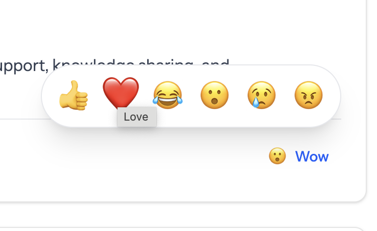

# Laravel Reactable

[](https://packagist.org/packages/truefans/laravel-reactable) 
[](https://github.com/VahanDrnoyan/laravel-reactable/actions?query=workflow%3Atests+branch%3Amain)
[](https://packagist.org/packages/truefans/laravel-reactable)

A beautiful, Facebook-style reactions system for Laravel with Livewire. Add customizable emoji reactions (like, love, laugh, wow, sad, angry) to any model in your Laravel application with a single trait.

## 📸 Demo

### Reaction Picker (Light Theme)


### Reaction Picker (Dark Theme)


### Reactions List with Filters (Light Theme)


### Reactions List with Filters (Dark Theme)


## ✨ Features

- 🎭 **Facebook-Style UI** - Beautiful reaction picker with hover/click interactions
- 🔥 **Livewire Powered** - Real-time reactions without page refresh
- 📦 **Polymorphic Relations** - React to Posts, Comments, Images, or any model
- 🎨 **Fully Customizable** - Configure reaction types, icons, colors via config
- 👥 **User Reactions List** - See who reacted with filterable tabs by reaction type
- ♾️ **Infinite Scrolling** - Seamlessly load more reactions as you scroll (v1.1.0+)
- 🌙 **Dark Mode Support** - Beautiful UI in both light and dark themes
- ⚡ **Optimized Queries** - Efficient database queries with proper indexing
- 🔒 **Unique Reactions** - One reaction per user per item (can be changed)
- 📱 **Responsive Design** - Works perfectly on mobile and desktop
- 🎯 **Smart Positioning** - Intelligent dropdown placement with Alpine.js Anchor plugin
- 🔄 **Auto-Flip** - Dropdowns automatically reposition to stay within viewport
- ♿ **Accessibility First** - Full keyboard navigation, focus management, and ARIA attributes for screen readers

---

## 📋 Requirements

- PHP 8.4+
- Laravel 11.0+ or 12.0+
- Livewire 3.0+
- Alpine.js (included with Livewire)

---

## 🚀 Installation

### Step 1: Install via Composer

```bash
composer require truefans/laravel-reactable
```

### Step 2: Publish Assets

Publish the migration, config, and views:

```bash
php artisan vendor:publish --provider="TrueFans\LaravelReactable\LaravelReactableServiceProvider"
```

### Step 3: Run Migrations

```bash
php artisan migrate
```

This creates the `reactions` table with:
- User ID
- Polymorphic relationship (reactable_id, reactable_type)
- Reaction type
- Unique constraint (one reaction per user per item)
- Optimized indexes

---

## 🔄 Infinite Scrolling (v1.1.0+)

Version 1.1.0 introduces infinite scrolling for the reactions list, providing a smoother user experience when viewing many reactions.

### Key Features:
- **Automatic Loading**: New reactions load automatically as you scroll down the list
- **Loading Indicator**: Shows a subtle loading spinner when fetching more reactions
- **Optimized Performance**: Loads in chunks to maintain performance
- **Seamless Integration**: Works with all existing features including reaction filtering

### How It Works:
The reactions list now uses Laravel's pagination with Livewire's `x-intersect` to detect when the user scrolls to the bottom of the list. When triggered, it automatically loads the next set of reactions.

## 📖 Usage

### Step 1: Add Reactions to Your Models

Add the `HasReactions` trait to any model you want to be reactable:

```php
use TrueFans\LaravelReactable\Traits\HasReactions;

class Post extends Model
{
    use HasReactions;
    
    // Your model code...
}
```

### Step 2: Eager Load Reactions (Important!)

**To prevent N+1 queries**, always eager load reactions in your controller:

```php
public function index()
{
    // ✅ CORRECT - Eager load reactions
    $posts = Post::with(['user', 'reactions'])
        ->latest()
        ->paginate(10);

    return view('posts.index', compact('posts'));
}
```

### Step 3: Display the Reactions Component

In your Blade views:

```blade
<livewire:reactions :model="$post" />
```

**That's it!** The component will automatically:
- Detect eager-loaded data and use it (no additional queries)
- Display a "Like" button (or current reaction if user has reacted)
- Show reaction picker on hover with all available reactions
- Display reaction count summary with top 3 reaction icons
- Show clickable reaction count with filterable tabs by reaction type

---

## 🎨 Configuration

### Customize Reaction Types

Edit `config/reactable.php`:

```php
return [
    'reaction_types' => [
        'like' => [
            'icon' => '👍',
            'label' => 'Like',
            'color' => 'blue',
        ],
        'love' => [
            'icon' => '❤️',
            'label' => 'Love',
            'color' => 'red',
        ],
        'laugh' => [
            'icon' => '😂',
            'label' => 'Laugh',
            'color' => 'yellow',
        ],
        'wow' => [
            'icon' => '😮',
            'label' => 'Wow',
            'color' => 'purple',
        ],
        'sad' => [
            'icon' => '😢',
            'label' => 'Sad',
            'color' => 'gray',
        ],
        'angry' => [
            'icon' => '😠',
            'label' => 'Angry',
            'color' => 'orange',
        ],
        // Add your own custom reactions!
        'fire' => [
            'icon' => '🔥',
            'label' => 'Fire',
            'color' => 'orange',
        ],
    ],

    'display' => [
        'show_breakdown' => true,  // Show detailed reaction breakdown
        'show_total' => true,      // Show total reaction count
        'show_tooltips' => true,   // Show tooltips on hover
    ],
];
```

---

## ♿ Accessibility

We've made significant improvements to ensure the reaction picker and dropdowns are fully accessible:

### Keyboard Navigation
- **Tab Navigation**: All interactive elements are properly included in the tab order
- **Arrow Keys**: Navigate between reaction options using left/right arrow keys
- **Enter/Space**: Select the currently focused reaction
- **Escape**: Close the reaction picker or dropdown

### Focus Management
- **Focus Trapping**: When any dropdown is open, focus is trapped within the component
- **Focus Wrapping**: Navigation wraps around when reaching the start/end of the focusable elements
- **Focus Return**: Focus returns to the trigger button when the dropdown is closed
- **Visible Focus**: Clear visual indicators for focused elements

### Dropdown Navigation
- **Reaction Picker**:
  - `→` Move focus to the next reaction
  - `←` Move focus to the previous reaction
  - `Escape` Close the picker
  
- **Reactions List**:
  - `→` Move focus to the next reaction filter tab
  - `←` Move focus to the previous reaction filter tab
  - `Escape` Close the list

### Screen Reader Support
- All interactive elements have proper ARIA attributes
- Focus management ensures screen readers announce changes correctly
- Buttons and controls have appropriate labels and roles


### Trait Methods

The `HasReactions` trait provides these methods:

```php
// Get all reactions relationship
$post->reactions();

// Add a reaction
$post->react('like', $user);  // User defaults to auth()->user()

// Remove a reaction
$post->unreact($user);

// Check if user has reacted
$post->hasReactedBy($user);  // Returns bool

// Get user's reaction type
$post->getReactionBy($user);  // Returns 'like', 'love', etc. or null

// Get reactions summary
$post->getReactionsSummary();  // Returns ['like' => 5, 'love' => 3, ...]

// Get total reactions count
$post->getTotalReactionsCount();  // Returns int

// Get count for specific reaction type
$post->getReactionsCountByType('like');  // Returns int
```

### Facade Methods

Use the `LaravelReactable` facade for helper methods:

```php
use TrueFans\LaravelReactable\Facades\LaravelReactable;

// Get all reaction types
LaravelReactable::getReactionTypes();

// Get specific reaction config
LaravelReactable::getReactionConfig('like');

// Validate reaction type
LaravelReactable::isValidReaction('like');  // Returns bool

// Get reaction type keys
LaravelReactable::getReactionTypeKeys();  // Returns ['like', 'love', ...]

// Get display settings
LaravelReactable::getDisplaySettings();
```

---

## 🎯 Advanced Usage

### Custom Reaction Permissions

The `canReact` method gives you complete control over reaction visibility and interaction in your application. It serves two main purposes:

1. **Visibility Control**: Determines if a specific reaction type should be shown to the current user
2. **Interaction Control**: Determines if the user can interact with (click/select) a specific reaction type

This is useful for implementing business rules like:
- Showing/hiding specific reactions based on user roles or permissions
- Preventing users from reacting to their own content
- Implementing cooldown periods between reactions
- Creating premium/exclusive reactions for specific user groups
- Temporarily disabling certain reaction types
- Implementing feature flags for reactions

#### Example: Prevent Users from Reacting to Their Own Posts

```php
use TrueFans\LaravelReactable\Traits\HasReactions;

class Post extends Model
{
    use HasReactions;
    
    /**
     * Control reaction visibility and interaction
     * 
     * @param string $type The reaction type (e.g., 'like', 'love')
     * @return bool Return false to hide the reaction and prevent interaction,
     *              or true to show and allow the reaction
     */
    public function canReact(string $type): bool
    {
        // Example: Prevent users from reacting to their own posts
        if (auth()->id() === $this->user_id) {
            return false;
        }

        // Example: Only allow 'like' and 'love' reactions
        if (!in_array($type, ['like', 'love'])) {
            return false;
        }

        // Example: Implement a cooldown period
        $lastReaction = $this->reactions()
            ->where('user_id', auth()->id())
            ->latest()
            ->first();

        if ($lastReaction && $lastReaction->created_at->gt(now()->subHour())) {
            return false; // 1-hour cooldown between reactions
        }

        return true;
    }
}
```

### Events

The component dispatches Livewire events:

```javascript
// Listen for reaction events
Livewire.on('reaction-added', (data) => {
    console.log('Reaction added:', data.type);
});

Livewire.on('reaction-removed', (data) => {
    console.log('Reaction removed:', data.type);
});
```

### Customizing the canReact Method

The `canReact` method receives the reaction type as a parameter, allowing you to implement different rules for different reaction types. The method should return `true` if the reaction is allowed, or `false` to prevent it.

#### Example: Role-Based Reaction Visibility

```php
public function canReact(string $type): bool
{
    // Hide all reactions for guests
    if (!auth()->check()) {
        return false;
    }

    // Only show premium reactions to premium users
    $premiumReactions = ['love', 'laugh', 'wow', 'sad', 'angry'];
    if (in_array($type, $premiumReactions) && !auth()->user()->isPremium()) {
        return false;
    }

    // Hide 'angry' reactions on Sundays (example of conditional logic)
    if ($type === 'angry' && now()->dayOfWeek === 0) {
        return false;
    }

    return true;
}
```

### Reaction Visibility vs Interaction

- When `canReact` returns `false` for a reaction type:
  - The reaction will be hidden from the reaction picker
  - The reaction will not be available in the filter tabs
  - Existing reactions of that type will be hidden from the reactions list
  - Users cannot interact with or select the reaction

- When `canReact` returns `true`:
  - The reaction is visible in the picker
  - The reaction appears in filter tabs (if any exist)
  - Users can see and interact with the reaction

### Avoiding N+1 Queries

**IMPORTANT:** To prevent N+1 query issues when displaying multiple posts with reactions, always eager load the reactions relationship:

```php
// ✅ CORRECT - Eager load reactions to avoid N+1
$posts = Post::with(['user', 'reactions'])
    ->latest()
    ->paginate(10);

// ❌ WRONG - Will cause N+1 queries
$posts = Post::with('user')
    ->latest()
    ->paginate(10);
```

**How It Works:**
- The Livewire component automatically detects if reactions are eager loaded
- If eager loaded: Uses the collection data (0 additional queries)
- If not eager loaded: Falls back to querying (causes N+1)

**Example Controller:**
```php
public function index()
{
    $posts = Post::with(['user', 'reactions'])
        ->whereNotNull('published_at')
        ->latest('published_at')
        ->paginate(10);

    return view('posts.index', compact('posts'));
}
```

**Query Optimization:**
- **Without eager loading:** 1 + (N posts × 2 queries) = 21+ queries for 10 posts
- **With eager loading:** 3 queries total (posts, users, reactions)

### Database Queries

Get posts with specific reactions:

```php
// Get posts with specific reaction
$lovedPosts = Post::whereHas('reactions', function($query) {
    $query->where('type', 'love');
})->get();

// Count reactions for a post
$reactionCount = $post->reactions()->count();

// Get all users who reacted to a post
$users = $post->reactions()->with('user')->get()->pluck('user');
```

---

## 🧪 Testing

Create test data with the included seeder:

```php
use TrueFans\LaravelReactable\Models\Reaction;

// Create reactions programmatically
public function run(): void
    {

        $reactionTypes = ['like', 'love', 'laugh', 'wow', 'sad', 'angry'];

        Post::factory()
            ->count(10)
            ->has(
                Reaction::factory()
                    ->count(100)
                    ->state(fn() => [
                        'user_id'        => User::factory(),
                        'type'           => fake()->randomElement($reactionTypes),
                        'reactable_type' => Post::factory(),
                    ])
            )
            ->create();

    }
```

---

## ♿ Accessibility Features

### Keyboard Navigation
- Full keyboard navigation support for all interactive elements
- **Tab** - Move between interactive elements
- **Enter/Space** - Activate buttons and toggles
- **Escape** - Close open dialogs and return focus to the triggering element
- **Arrow Keys** - Navigate between reaction options and filter tabs
- **Home/End** - Jump to first/last item in lists

### ARIA Attributes
- `role="menu"` and `role="menuitem"` for reaction picker
- `role="dialog"` for modals with proper labeling
- `aria-expanded` to indicate expandable/collapsible elements
- `aria-pressed` for toggle buttons
- `aria-live` regions for dynamic content updates
- `aria-busy` for loading states
- `aria-label` and `aria-labelledby` for better screen reader context

### Focus Management
- Focus is trapped within open dialogs
- Focus returns to the triggering element when dialogs close
- Focus is managed during dynamic content loading
- Hidden elements are removed from the tab order

### Screen Reader Support
- All interactive elements have appropriate labels
- Status messages for reactions and loading states
- Semantic HTML structure for better navigation
- Hidden text for screen readers where visual context is insufficient

### Color Contrast
- Meets WCAG 2.1 AA contrast requirements
- Proper color contrast in both light and dark modes
- Visual indicators beyond color for interactive states

## 🎨 UI Components & Interactions

### Main Like Button
- **Default State:** Shows thumbs-up icon with "Like" text
- **After Reacting:** Shows your reaction emoji and label (e.g., "❤️ Love")
- **Click:** Opens reaction picker (or removes your reaction if already reacted)
- **Hover Effect:** Background changes to indicate interactivity
- **Color:** Blue when you've reacted, gray when you haven't

### Reaction Picker
- **Appears:** Above the Like button on hover
- **Layout:** All reaction emojis in a single horizontal row
- **Smart Positioning:** Uses Alpine.js Anchor plugin for intelligent placement
  - **Auto-flip:** Automatically repositions to stay within viewport
  - **Placement:** Prefers top-end (above button, right-aligned)
  - **Fallback:** Flips to bottom or sides if no space above
  - **Offset:** 8px gap from button for better spacing
- **Interactions:**
  - Hover over emoji → Scales up with animation
  - Click emoji → Saves reaction and closes picker
  - Hover away → Closes picker automatically
- **Animations:** Smooth fade-in/out with scale transitions
- **Accessibility:** ARIA labels and focus rings for keyboard navigation

### Reaction Count Summary
- **Display:** Top 3 reaction icons as overlapping circles + total count
- **Position:** Left side of the component (opposite of Like button)
- **Clickable:** Click to open detailed reactions list
- **Hover Effect:** Background changes to indicate it's clickable
- **Dynamic:** Only appears when post has reactions

### Reactions List Dropdown
- **Opens:** When clicking on reaction count summary
- **Smart Positioning:** Uses Alpine.js Anchor plugin for intelligent placement
  - **Auto-flip:** Automatically repositions to stay within viewport
  - **Placement:** Prefers top-start (above button, left-aligned)
  - **Fallback:** Flips to bottom or sides if no space above
  - **Offset:** 8px gap from button for better spacing
- **Width:** Auto-width (min 320px, max 448px) - expands based on content
- **Features:**
  - **Filterable Tabs:** Switch between "All" and specific reaction types
  - **Active Tab:** Highlighted in blue
  - **Tab Counts:** Shows number of each reaction type
  - **Tab Wrapping:** Tabs wrap to multiple lines if needed (no horizontal scroll)
  - **User List:**
    - User avatar (first letter in gradient circle)
    - User name
    - Reaction time (e.g., "2 hours ago")
    - Reaction emoji on the right
  - **No Scrollbars:** Full height display without vertical scrolling
  - **Click Outside:** Closes dropdown automatically
  - **Hover Effects:** Each user row highlights on hover
- **Accessibility:** Proper ARIA attributes and keyboard navigation

### Smart Positioning Technology
- **Powered by:** Alpine.js Anchor plugin (included with Livewire by default)
- **Benefits:**
  - Zero configuration required
  - Automatic viewport detection
  - Intelligent fallback positioning
  - No overflow or clipping issues
  - Works with scrolling and resizing
  - Lightweight (~2KB)
- **How it works:**
  - Monitors button position in real-time
  - Calculates available space in all directions
  - Automatically chooses best position
  - Smoothly transitions between positions

### Responsive Design
- Works perfectly on mobile and desktop
- Touch-friendly button sizes
- Prevents horizontal scrolling
- Proper z-index layering for dropdowns
- Smart positioning adapts to screen size
- No fixed positioning issues on mobile

---

## 🧪 Testing

The package includes a comprehensive test suite with 59 tests covering all functionality.

```bash
# Run tests
composer test

# Run tests with coverage
composer test-coverage

# Run specific test file
vendor/bin/pest tests/HasReactionsTraitTest.php
```

**Test Coverage:**
- ✅ HasReactions trait (20 tests)
- ✅ Reaction model (11 tests)
- ✅ Livewire component (26 tests)
- ✅ Architecture tests (2 tests)

For detailed testing documentation, see [tests/README.md](tests/README.md) and [tests/TESTING_GUIDE.md](tests/TESTING_GUIDE.md).

---

## 🤝 Contributing

Contributions are welcome! Please feel free to submit a Pull Request.

**Development Setup:**
1. Clone the repository
2. Run `composer install`
3. Run tests with `composer test`
4. Make your changes
5. Ensure all tests pass
6. Submit a PR

---

## 📝 License

The MIT License (MIT). Please see [License File](LICENSE.md) for more information.

---

## 👨‍💻 Credits

- [Vahan Drnoyan](https://github.com/VahanDrnoyan)
- [All Contributors](../../contributors)

---

## 🆘 Support

If you discover any issues or have questions, please [open an issue](https://github.com/truefans/laravel-reactable/issues).

---

**Made with ❤️ by TrueFans**
